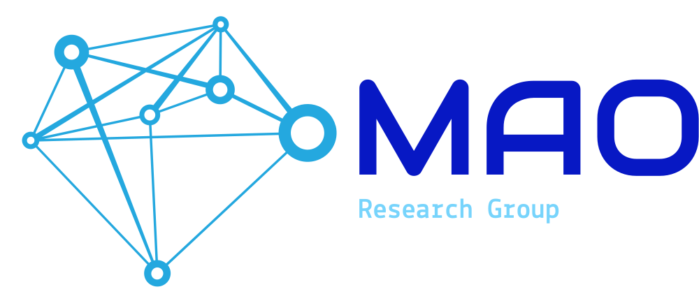

  

    <h1>Modeling, AI, and Optimization for Engineering Design</h1>
    

      We develop methods for simulation-based design optimization, dimensionality reduction,
      surrogate modeling, and machine learning for complex engineering systems, with applications
      in marine, aerospace, and multidisciplinary vehicle design.
    

    

      <a class="md-button md-button--primary" href="research/">Research</a>
      <a class="md-button" href="people/">People</a>
      <a class="md-button" href="projects/">Projects</a>
      <a class="md-button" href="software/">Software</a>
    

  

## About

The MAO Research Group works on advanced computational methods for engineering design, with a focus on:

- simulation-based design optimization
- dimensionality reduction for shape optimization
- physics-informed and multi-fidelity surrogate models
- machine learning for marine and aerospace applications
- reproducible computational workflows and open scientific software

## Research Areas

<h3>Dimensionality Reduction</h3>

Reduced-order representations of high-dimensional design spaces, including PME and its physics-informed variants.

<h3>Simulation-Based Design Optimization</h3>

Optimization frameworks for expensive engineering simulations, including multi-objective and many-fidelity settings.

<h3>Scientific Machine Learning</h3>

Integration of machine learning with physical models for design exploration, prediction, and interpretability.

<h3>Marine and Aerospace Applications</h3>

Applications to ships, propellers, underwater vehicles, airfoils, and advanced transportation systems.

## Featured Resources

<h3>Projects</h3>

Ongoing and past research projects, collaborations, and funded activities.

<a href="projects/">Explore projects →</a>

<h3>Software</h3>

Open and in-development research software supporting reproducible computational design workflows.

<a href="software/">Explore software →</a>

<h3>Datasets</h3>

Research datasets for dimensionality reduction, optimization, and computational benchmarking.
Available via our Zenodo collection.

<a href="datasets/">Explore datasets →</a> 
<a href="https://zenodo.org/communities/cnr-inm-mao/">View on Zenodo →</a>

<h3>Publications</h3>

Selected journal articles, conference papers, and software-related outputs.

<a href="publications/">Explore publications →</a>

## Highlights

!!! note
    This website is documentation-oriented by design: lightweight, maintainable, and directly connected to the group’s research outputs, software, and datasets.

## News

You can use this section for brief updates such as:

- new papers
- released software
- open positions
- conference sessions
- funded projects
